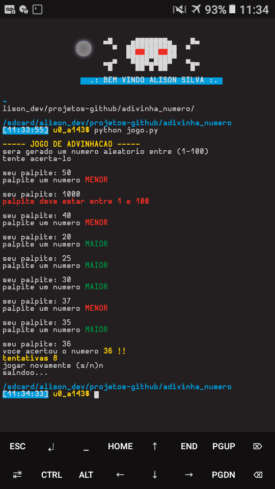

## jogo de advinhação

### sobre o jogo
nesse jogo de **CLI**(linha de comando) sera gerado um numero aleatorio entre 1 e 100 e seu objetivo é acerta-lo.  
cada palpite que voce der, se nao for o numero gerado sera dada uma mensagem de ajuda que dira se seu palpite foi **BAIXO** ou **ALTO** comparado com o numero gerado.  

se o palpite for maior exibira **MAIOR**
se o palpite for menor exibira **MENOR**  

quando voce acertar o numero gerado, sera mostrado o numero e quantas tentativas voce usou para acertar-lo

para rodar esse *CLI gamer* sera necessario ter o **python3+** instalado, se nao tiver o python instalado ainda  

Baixe pelo site
[site do python](htttps://www.python.com)

instale pelo **CMD**
> apt-get install python3

---
[CANAL DO FACEBOOK](https://)
